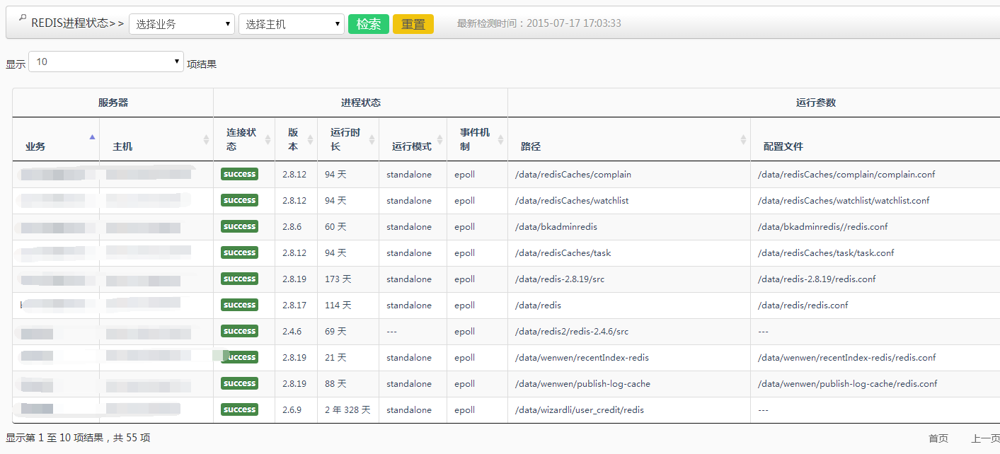
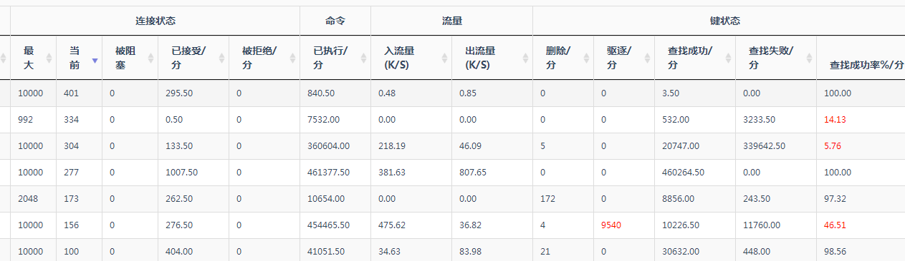
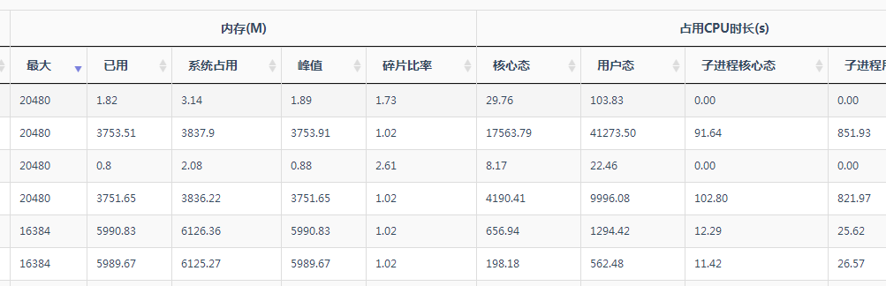
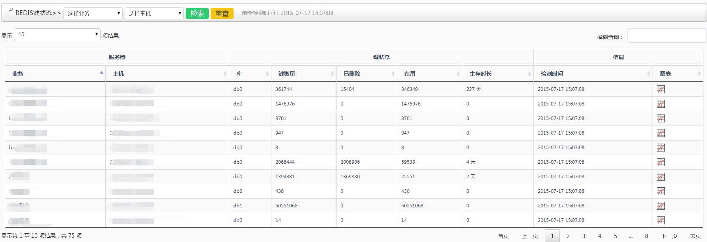
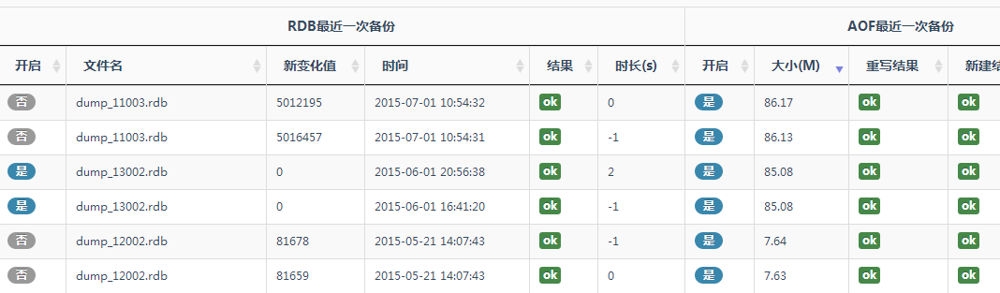
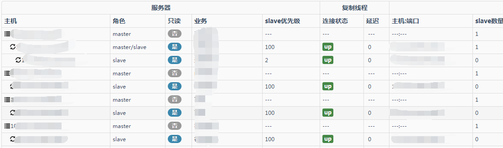
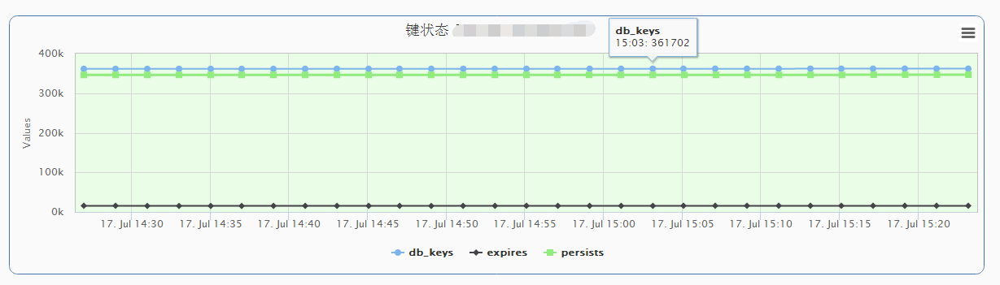

#RedisMM ---Redis manage and monitor system

##RedisMM做什么用的？
  本系统是针对Redis的企业级管理和监控系统，主要功能包括Redis运行状态数据采集、展示、监控、RDB/AOF远程备份、告警等。因为我们部门需要使用Redis，但是调研现有的Redis监控都不能很好的满足我们的需求，比如通过在命令行使用的redis-faina、redis-stat，有web页面的redis-live、redis-monitor等等，所以针对Redis开发了这套管理监控软件。
 
##RedisMM有那些功能？
针对Redis运行的各详细参数，进行数据采集和监控，并有完善的图表展示，根据不同收敛方式的告警策略，监控内容大致如下：
+ 进程状态
连接状态(是否可用)、版本、运行时长、路径、配置文件等。
+ 性能状态
最大连接数、当前连接、执行命令、流量、键查找成功率等。
+ 资源状态
最大内存、已用内存、峰值、内存碎片、占用CPU状态等。
+ 键状态
库、键数量、删除数、在用数等。
+ 备份监控
RDB和AOF是否开始备份，以及备份文件名、大小、备份结果等。
+ 主从监控
主备拓扑、复制状态、slave数量、延迟等。
+ 冷备管理
定期备份RDB、AOF文件到指定的机器目录，可设置备份周期、保存备份数、告警等。

##对Redis要求？
Redis版本：>2.4，小于此版本未经测试。

##系统运行环境？
系统所在机器需要安装lamp环境，即采用了linux+apache+mysql+php+python等，要求python2.7，php5.3以上，低于此版本未经测试。


##配置
+ 后台配置：
```bash
  1)初始化mysql库表。按照sql/init.txt执行。
  2)配置项。monitor/conf/config.ini中配置monitor_server项。
  3)告警接口。monitor/global_functions.py中send_alarm配置您公司的告警接口。
  4)启动。monitor/redisMM_ctl.sh  Usage: ./redisMM_ctl.sh {start|stop|restart|status}
```
+ 前台配置：
```bash
  1)安装lamp配置环境,配置apache并重启 ./apachectl -k restart
  2)配置frontweb/application/config/database.php，同monitor/conf/config.ini中的配置。
```
+ 附apache配置示例：
```bash
  <VirtualHost yourip:port>
    DocumentRoot "/data/redisMM/frontweb"

    ErrorLog /data/ApacheLogs/redisMM_error_log
    CustomLog /data/ApacheLogs/redisMM_access_log

    <Directory /data/redisMM/frontweb>
      Options -Indexes FollowSymLinks
      AllowOverride None
      DirectoryIndex index.html index.php
      Order allow,deny
      Allow from all
    </Directory>
  </VirtualHost>
```

##系统截图
* 进程状态

* 运行状态

* 资源状态

* 键状态

* 备份状态

* 主备状态

* 冷备

* 内存使用图表

* 键状态图表

* 键查找图表

* 连接状态图表

* 主机管理

* 告警展示


本系统实际使用中监控近100个实例，运行状态良好。这是本人的第一个开源项目，希望大家多多鼓励支持，并在使用过程中提出宝贵意见，再进行系统的不断优化，谢谢！

##作者
* blythli


